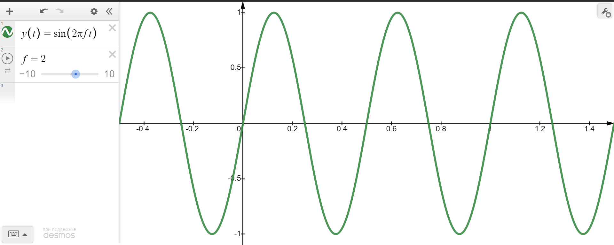
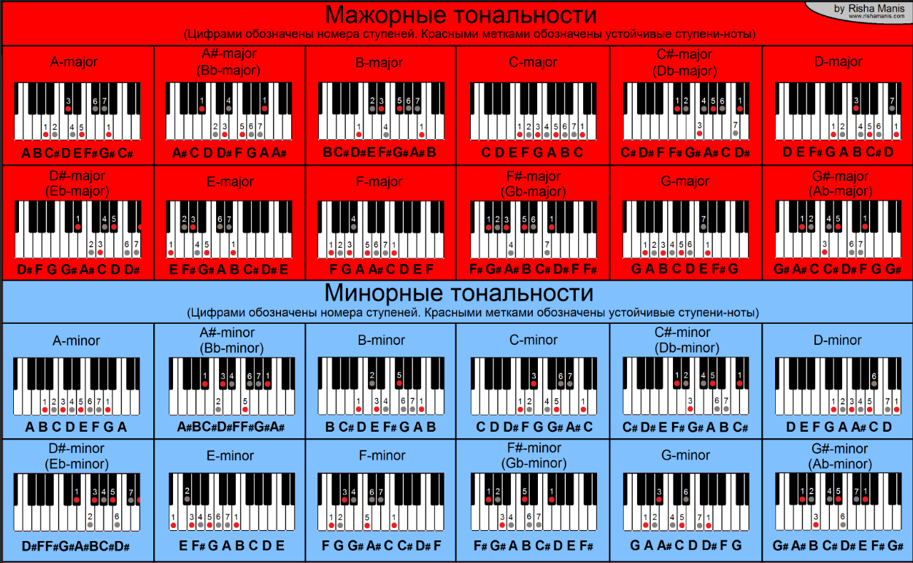

​                                                                             **Music Theory.  Practical view.**

​                                                                                                **v 2.0, 2023**

​                                                                       **Антипов Александр (VK: "@alectroid")**


***

**Содержание**

[TOC]

***

# Введение

Данное пособие изначально создавалось для практических нужд ее автора. Поэтому она является сборником основных выкладок из физики звука и теории музыки, и написана исключительно из его личных побуждений. Принятое позже решение доработать и опубликовать накопленные материалы вызвано тем, что друзья и коллеги автора при разговоре на музыкальную тему часто задают ему схожие вопросы, конструктивный ответ на которые требует длительного времени и некоторой сноровки. В любом случае, лишний раз подробно окунуться в мир музыки с физической, математической и философской точек зрения оказалось полезным. Автор ничуть не жалеет потраченного времени.

У данного пособия есть ряд преимуществ над классическими изданиями на тему теории музыки (см. список литературы). Во-первых, материал здесь изложен лаконичнее, что может понравиться людям с музыкальным образованием. Во-вторых, каждый научный факт или правило сопровождается мыслями об идеях, которые лежали в основе этих принципов. Автор стремился сделать акцент на понимание основ теории музыки, выстраиванию верной методики для успешного продолжения изучения в этой сфере.

Так как контент расчитан на широкую публику, то в пособии присутствует огромное количество примеров с иллюстрациями, интересных фактов из научпопа. В некоторых главах есть мемы. В конце пособия приведен список использованных источников.

Пару слов об авторе. Главную роль в освоении и последующем изложении данного материала сыграла <u>**многолетняя практика**</u> (7 лет муз. школы, практика в блюзовых импровизациях, сочинительстве; выступления в составе школьных и студеньческих групп, организация муз. вечеров). Т.к. автор не заканчивал музыкальную консерваторию, а имеет инженерное образование, то в изложении определений терминов и принципов сольфеджио могут быть <u>*негрубые*</u> неточности. Самый главный аргумент в его защиту: абсолютно все, изложенное в пособии, <u>неоднократно применялось на практике</u> (от создания партитур с последующей публикацией до реализации программных моделей звуковых фильтров на языке Python).

В данном пособии читатель может найти ответы на следующие запросы:

* Физика звука, спектр, тембр, эксперименты с ними
* Как родилась первая музыкальная система и какая она сейчас
* Синтез звука на языке Python
* Что такое нота, интервал, аккорд, тональность и зачем их ввели
* Базовые методы аранжировки с перечислением паттернов и примеров
* Алгоритм подбора на слух
* Подход к написанию аранжировки или собственного сочинения
* Роль актерского таланта и культурной деятельности в освоении музыки
* Качественные шпоргалки для C-dur/A-moll; G-dur/E-moll (от физики до аранжировок)
* Литература и прочий смежный контент 

Автор желает читателю преисполниться в своих познаниях и лишь усилить любовь к музыке! 

# Физический уровень

## Определения звука и математические функции

Звук — **физическое явление, представляющее собой распространение упругих волн в газообразной, жидкой или твёрдой среде**. В узком смысле под звуком имеют в виду эти волны, рассматриваемые в связи с тем, как они воспринимаются органами чувств человека или животных ([link](https://ru.wikipedia.org/wiki/%D0%97%D0%B2%D1%83%D0%BA)). Для описания этого явления в физике была придумана модель с одноименным названием - волновая теория или теория колебаний, которая основывается на математических свойствах гармонических функций: синуса и косинуса. **Самое важное из них - наличие периода, а значит и частоты.**

> **Замечание:**
>
> Слышимый диапазон человеческого уха: 20Гц - 20кГц. С возрастом верхняя граница уменьшается.



Гармонические функции описывают самые простые колебания, которые возможны: монотонные, с постоянной амплитудой, частотой и фазой. Их тоже называют гармоническими. Более сложные колебания описываются суперпозицией гармонических. Математически это выражается рядом Фурье:
$$
S(x) = a_0 + \sum_{n=1}^{+\infty}(a_n\cos(nx)+b_n\sin(nx))
$$
Т.е. любую физическую функцию (т.е. абсолютно интегрируемую) можно на некотором отрезке разложить в ряд синусов и косинусов с разными фиксированными частотами. 

Как следствие, возникло **преобразование Фурье**:
$$
\text{Прямое преобразование Фурье: переход из временной в частотную область} \\
X(f)=\int_{-\infty}^{+\infty}x(t)\exp(-2i\pi ft)\ dt \\ 
\text{Обратное преобразование Фурье: переход из частотной во временную область} \\
x(t)=\int_{-\infty}^{+\infty}X(f)\exp(2i\pi ft)\ df
$$
Оно позволяет упростить анализ звука, перейдя из пространства времени в пространство частот (т.е. когда по оси Ox не время, а частота). Представление звука в частотном пространстве называется **спектром**. Для примера рассмотрим гармонический сигнал: его вид во временной шкале (функция синуса или косинуса) и спектральной (дельта-функция).


[Link](https://nashaucheba.ru/v15501/?cc=4)

Очевидно, что описание в виде спектра выглядит проще. Поэтому оно активно используется на практике, и реальные сигналы изображаются в виде спектрограммы:


[Link](https://commons.wikimedia.org/wiki/File:Especrtograma_harm%C3%B2nic.png)

Таким образом, звук с математической точки зрения - совокупность частот разных амплитуд (спектр). Форма спектрограммы напрямую влияет на окрас звука, что называется **тембром**. Голос человека или музыкальный инструмент - все имеет свой неповторимый тембр (спектрограмму).

## Основной тон и обертона. Как появилась первая музыкальная система

В волновой теории при рассмотрении задачи о колебаниях струны с закрепленными концами (например, струны гитары) доказывается, что они соответствуют суперпозиции колебаний с гармоническими частотами $f_0, 2f_0, 3f_0, 5f_0, 6f_0, ...$ Самая низкая частота имеет максимальную амплитуду и называется основным тоном и задает ноту (поговорим о нотах в дальнейшем). Остальные - обертона - влияют на тембр. Например, взглянем на спектр вздернутой 1-й струны 6-струнной акустической гитары, полученный с помощью приложения Spectroid:


Заметим, что $328:656:984:1312=1:2:3:4$.

А вот спектрограмма при нажатии одной из клавиш фортепиано (струнно-ударно-клавишный инструмент):


Связь основного тона и обертонов аналогичная: $164:328:492:820=1:2:3:5$.

У обертонов есть наглядная физическая интерпретация. Дело в том, что отношение частоты основного тона к любому обертону равно отношению длин, в котором струна делится прижатом к ней пальцем (короткого отрезка ко всему). Сама струна при зажатии начинает звучать на частоте обертона.


[Link](https://bigenc.ru/physics/text/2222330?)

> Замечание:
>
> Колебательные движения струны, порождающие обертон также называют **модой** колебаний струны ($n$).

Если приноровиться, то при дергании струны гитары можно услышать ее первый обертон ($2f_0$). Окажется, что его частота соответсвует основному тону тембра струны, если зажать ее строго посередине.

На струнных инструментах (на акустической гитаре) существует масса приемов, завязанных на спектральную природу звука. Один из них - **фладжалеты**. Еще раз дернем 1-ю струну гитары и запишем спектр (верхний рисунок). Теперь дернем ее с слегка прижатым пальцем к левому краю струны. Должно получиться более мягкое звучание, которое ближе всего к гармоническому. На спектрограмме при этом будет наблюдаться меньше линий (нижний рисунок):


Об этих эффектах миру было очень давно. Так, древнегреческий ученый Пифагор на основе знаний об обертонах, изобрел **натуральным строй**. Для этого он использовал монохорд - аналог гитарной струны с одной подвижной перемычкой.


[Link](https://guitarplayer.ru/guitar-offtopic-flame-others/muzykalnaya-sistema-iz-16-not-pomogite-proverit/new/)

Восстановим натуральный строй. Пусть частота струны без перемычки равна $f_0$. Тогда мы можем интуитивно сразу же получить $2f0$, зажав струну посередине. Мы изобрели **октавный принцип**:

```
Звуковые частоты с соотношением 2 или 0,5 - мелодичны. Интервал из таких частот называется октавой.
```

Далее зажмем треть струны и дернем ее в короткой части. Получим частоту $3f_0$. Применяя октавный принцип, поместим ее в диапазон $[f_0;2f_0]$. Получим $\frac{3}{2}f_0$ - чистая квинта. Если рассматривать частоту $f_0$ как второй обертон струны с тоном $\frac{1}{3}f_0$, то после применения октавного принципа получим чистую кварту - $\frac{4}{3}f_0$. И так далее.

В общем случае получаем формулу:
$$
f_{mn} = \frac{m}{n}f_0 \\
m, n \in Z\backslash\{0\}
$$

В современный 12-нотный натуральный строй входят следующие интервалы:
$$
\text{Совершенные консонансы:} \\
f_{\text{основной тон (прима)}} = f_0 \\
f_{\text{октава}} = 2f_0 \\
f_{\text{кварта}} = \frac{4}{3}f_0 \\
f_{\text{квинта}} = \frac{3}{2}f_0 \\
\\
\text{Несовершенные консонансы:} \\
f_{\text{м. терция}} = \frac{6}{5}f_0 \\
f_{\text{б. терция}} = \frac{5}{4}f_0 \\
f_{\text{м. секста}} = \frac{8}{5}f_0 \\
f_{\text{б. секста}} = \frac{5}{3}f_0 \\
\\
\text{Диссонансы:} \\
f_{\text{тритон (ув.кварта = ум.квинта)}} = \frac{45}{32}f_0 \\
f_{\text{м. секунда}} = \frac{16}{15}f_0 \\
f_{\text{б. секунда}} = \frac{9}{8}f_0 \\
f_{\text{м. септима}} = \frac{16}{9}f_0 \\
f_{\text{б. септима}} = \frac{15}{8}f_0 \\
$$
Натуральный строй звучит очень красиво. Может возникнуть вопрос: почему красочность звука зависит от обертонов?

С одной точки зрения, совпадение частот с обертонами уменьшает число линий в спектрограмме и, как следствие, сводит вероятность биений и других "некрасивых" звуковых эффектов к минимуму. С другой точки зрения, обертона являются неотъемлемой частью любого звука. Эволюционируя, слуховой аппарат стал воспринимать их естественным образом, не вызывая негативной реакции у организма. Совершенные консонансы - самые близкие обертоны, и они имеют далеко не нулевую амплитуду. Их часто можно услышать в природе. Диссонансы же самые отдаленные обертоны, и их амплитуда в естественной среде стремится к нулю. Увеличивая ее или приравнивая к амплитуде основного тона мы синтезируем неестественный и редкий звук. Поэтому он воспринимается негармонично.

> **Замечание:**
>
> Это авторская гипотеза.

У натурального строя есть большой недостаток: его частоты неравномерны, т.е. не образуют линейную систему. Это означает, что к нему не применим мощный математический аппарат линейной алгебры (с научной точки зрения). Как следствие, в нем невозможны модуляции или транспонирование, а если речь о цифровых системах - не применимы дискретные линейные стационарные фильтры (LTI).

Этих недостатков лишен **равномерно темперированный строй**:

* Частота ноты Ля первой октавы `f0 = 440 Гц`

* Частоты других нот получаются по формуле:
  $$
  f_n = f_0 \cdot (2)^{\frac{n}{12}} \\
  n \in Z
  $$
  
* 

В математике существует функция, которая обладает свойством линейности в проcтранстве множителей - это логарифм:
$$
\text{Свойство линейности:} \\
\forall x, y \in L;  \ \forall a,b \in R \\
ax + by \in L \\

\text{Линейное свойство логарифмов:} \\
\log x^a\cdot y^b = a\log x + b\log y
$$
Это означает, что основновные тона равномерно темперированного строя в логарифмическом измерении образуют линейную систему. Так, в частности, на спектрограмме частоты смежных звуков лежат на одинаковых расстояниях друг от друга (в логарифмическом маштабе):


* Появляется возможность транспонирования, для которого выполняется равенство отношений частот:

$$
\frac{V_0}{V} = \frac{W_0}{W}
$$

С геометрической точки зрения это означает линейный сдвиг по оси частот в логарифмическом пространстве.

> **Замечание:**
>
> В музыкальной практике транспонирование означает сохранение узнаваемости мелодии при пропорциональном изменении частот звучания инструмента. Гитаристы для транспонирования мелодии без изменения техники игры используют каподастр.

**Именно равномерно темперированный строй считается стандартным и используется по умолчанию.** 

> **Замечание:**
>
> В равномерно темперированном строю некоторые частоты буквально "подогнаны", на несколько центов. Красота гармоничного звучания приносится в жертву матемтике. Однако это практически не ощущается ушами (если явно не натренировать их, например, проигрышем мелодии в натуральном строю и равномерно темперированном, для сравнения).

Аналоговое представление гармонического сигнала и преобразования Фурье не применяется в цифровых системах. Используются их дискретные формы. Например, сигнал $x$ в дискретном времени $k$ примет вид:
$$
x[k] = \frac{A}{2}(\sin(2\pi fk)+1) \in [0;1] \\
k \in [0;1; \Delta k=\frac{1}{f_d}] \\
A \in [0;1]
$$
Здесь $A$ - амплитуда, $f_d$ - частота дискретизации (**44100 Гц**), $f$ - частота тона (в Гц), $k$ - аналог времени (шаг в секундах). 

> **Замечание:**
>
> Дискретный аналог преобразования Фурье - ДВПФ (DTFT), ДПФ (FFT).

Например, сигнал ноты Ля первой октавы (440Гц) на языке Python:

```Python
# Jupyter Notebook
import scipy.io.wavfile
from IPython.display import Audio
import soundfile as sf
from scipy import signal
import numpy as np
import matplotlib.pyplot as plt

fd = 44100
f = 440. # A1
k = np.arange(fd) / fd
x_k = np.sin(2*np.pi*f*k)

plot_signal(x_k)

file_name = 'test'
output = sf.SoundFile(f'./{file_name}.wav', 'w', samplerate=44100, channels=1)
output.write(filter_2(sound))
Audio(f'./{file_name}.wav')
```


Послушать элементарные сэмплы (т.е. тоны) можно на сайте: https://www.szynalski.com/tone-generator/

Cэмпл - период звукового сигнала (например, период синуса частоты 440), является единицей тембра. Самые базовые сэмплы: sin_wave (самый приятный), square_wave (самый жесткий), sawtooth_wave (среднее между предыдущими) и т.д. На сэмпл могут накладываться амплитудные фильтры: функция нарастания (attack) в начале сигнала, и функция затухания (release / delay). Они устраняют артефакты на границах аудиозаписи сэмлпа, что очень важно при их сшивке.

Звук - периодическая последовательность сэмлов. К нему можно применять разные фильтры. Например, амплитудную или частотную модуляции, реверберацию и др.

Сочетание звуков (например интервал - два звука) получается арифметическим сложением сигналов. Из-за ограниченности разрядности ЦАП при суммировании важно учитывать возможное запредельное увеличение амплитуды. Потому нужно брать минимум среднее арифметическое. Например, чтобы воспроизвести аккорд Am:
$$
x_{\text{Am}}[k]=\frac{x_A[k]+x_C[k]+x_E[k]}{3}
$$


# Логический уровень (основы сольфеджио)

Нота - удельный элемент гармонии инструмента, т.е. звук соответствующей нажатию одной клавиши или дерганию одной струны с зажатым табом.

Нота характеризуется двумя параметрами: названием и принадлежностью к октаве.

## Таблица нот

| 1      | 2                   | 3      | 4                   | 5      | 6      | 7                     | 8        | 9                     | 10     | 11                  | 12     |
| ------ | ------------------- | ------ | ------------------- | ------ | ------ | --------------------- | -------- | --------------------- | ------ | ------------------- | ------ |
| **До** | До диез / Ре бемоль | **Ре** | Ре диез / Ми бемоль | **Ми** | **Фа** | Фа диез / Соль бемоль | **Соль** | Соль диез / Ля бемоль | **Ля** | Ля диез / Си бемоль | **Си** |
| **С**  | С# / Db             | **D**  | D# / Eb             | **E**  | **F**  | F# / Gb               | **G**    | G# / Ab               | **A**  | A# / B              | **H**  |


[Link](https://www.piano-keyboard-guide.com/piano-notes-and-keys-how-to-label-keys-piano-keyboard-layout/)

> **Замечание:**
>
> Диез (sharp) - повышение ноты на полутон
>
> Бемоль (flat) - понижение ноты на полутон
>
> Бекар (natural) - отмена знака
>
> В равномерно темперированном строе диезы и бемоли смежных нот совпадают. С точки зрения физики использование бемолей, или диезов, или обоих - роли не играет. Разные знаки используются для упрощения написания партитуры в заданной тональности. О тональностях будет написано ниже.
>
> <u>Также заметим, что Си обозначается буквой Н, а Си бемоль - B. Будем придерживаться именно этих обозначений.</u>
>
> А еще, кроме диезов и бемолей, существуют дубльдиезы и дубльбемоли. С точки зрения физики это экзотическое украшение.


На любом инструменте количество нот в разы больше, однако они сгруппированы по октавам, каждая из которых включает 12 нот с описанными выше названиями. Таким образом, для указания ноты говорят, например: "Сыграй Ре второй октавы."

> **Замечание:**
>
> На пианино ноты симметричны относительно октавы, т.е. **Ля первой октавы** выглядит на клавиатуре также, как **Ля второй октавы**, только расположена левее на 12 клавиш (а по частоте звука - вдвое меньше).
>
> На пианино ноты с диезом - черные. Остальные - белые.


На пианино бывает от 12 до 88 клавиш. Полная раскладка включает 9 октав, часть из которых неполные. Справа налево их называют: cубконтур, контур, большая, малая, 1-я, 2-я, 3-я, 4-я и 5-я октавы.


[источник](https://uchenikspb.ru/kbase/oktavy-na-pianino/)


[Link](https://studopedia.ru/26_102186_urok--i-snova-akkordi.html)

## Интервалы (расстояния между парой нот)

Полутон - **расстояние/интервал** между двумя ближайшими нотами.

Тон - два полутона.

| Название интервала | прима | м.секунда | б.секунда | м.терция | б.терция | кварта | ув.кварта/ум.квинта | квинта | м.секста | б.секста | м.септима | б.септима | октава |
| ------------------ | ----- | --------- | --------- | -------- | -------- | ------ | ------------------- | ------ | -------- | -------- | --------- | --------- | ------ |
| Число полутонов    | 0     | 1         | 2         | 3        | 4        | 5      | 6                   | 7      | 8        | 9        | 10        | 11        | **12** |

> **Замечание:**
>
> Наиболее часто используются интервалы: **кварта, квинта, октава, м/б терция.**


[Источник](https://soundtimes.ru/uroki-muzyki/chto-takoe-intervaly-v-muzyke-uchim-intervaly)

## Аккорды и обращения, о типах аккордов

Аккорд - набор из 3-х и более нот, звучащих одновременно.

Трезвучие - аккорд из 3-х нот

Септаккорд - аккорд из 4-х нот

Обращения аккорда - переупорядоченные наборы нот, соответствующих аккорду. Например, у аккорда До-Ми-Соль (нажимаются на пианино справа налево) всего есть три обращения: исходное, Ми-Соль-До, Соль-До-Ми.

Ниже приведены обращения трех аккордов.


[Источник](https://korobtsov.ru/windows/glavnye-trezvuchiya-v-tonalnosti-sol-mazhor-glavnye-trezvuchiya-v/)

> **Замечание:**
>
> Здесь приведены 3 главных аккорда тональности До мажор: До мажор (тоника), Фа мажор (субдоминанта), Соль мажор (доминанта). О тональностях см. ниже.

Обращения аккорда C-dur на пианино.


[Источник](https://myslide.ru/presentation/solfedzhio-38-klass)

Помимо обращений существуют разные типы аккордов. Они в отличие от обращений меняют гармоническую окраску звука:

* Мажорный (веселый гармонический оттенок)
* Минорный (грустный)

> **Замечание:**
>
> <u>Аккордов и их обращений намного больше. Подробнее о них будет написано ниже. Для понимания основ теории музыки достаточно ограничиться мажорными и минорными трезвучиями в первом (основном) их обращении ($5_3$).</u> 

# Концептуальный уровень (теория музыки)

Благодаря транспонированию одна и та же мелодия будет узнаваема в разных множествах нот (наблюдается сюрьекция при отображении нот на мелодии). Это означает, что существует некотороя мат. модель, оперирующая над уровнем звуков и не привязанная к ним. Будем называть ее **тональностью**.

**Музыка оперирует не отдельными звуками, а интервалами.** **Автор призывает мыслить именно расстояниями, а не отдельными точками в пространстве нот.** Интервалы легче воспринимаются на слух и имеют уникальное характерное звучание вне зависимости от того, где именно на клавиатуре они взяты.

<u>Тональность - музыкальная система отсчета</u>, характеризующаяся:

1. Началом отсчета (выбранной нотой)

2. Типом (мажор/минор/гармонический минор/мелодический минор)

3. Упорядоченным множеством нот, каждая из которых именуется порядковым номером (ступенью)

   > **Замечание:**
   >
   > Всего ступеней 7, восьмая есть первая ступень следующей октавы. Ниже представлены ступени До мажора.
   >
   > 

4. Часть этих нот являются функциональными, т.е. производными для построения гармонии. Из них рождается аккомпанемент. Он может состоять как из отдельных нот, так и из интервалов или аккордов. *Аккомпанементу посвящены отдельные главы.*

   > **Замечание:**
   >
   > Типичное мажорное звучание - веселье - большая терция
   >
   > Типичное минорное звучание - грусть - малая терция
   >
   > Квинта, кварта, октава - все они звучат одинаково в мажоре и миноре (т.е. по их звучанию без контекста невозможно понять, звучит мажорный лад или минорный)

<u>Здесь и далее в качестве примеров будем рассматривать тональности:</u> 

* **До-мажор (C-dur) и Ля минор (A-moll)** - рай для пианистов (все клавиши - белые);
* **Соль мажор (G-dur) и Ми минор (E-moll)** - рай для гитаристов (потребуется лишь одно баре на 2-м ладу).


[Link](https://ivanovo-diving.ru/na-chto-vliyaet-tonalnost.html)

## Множество нот тональности

После выбранного начало отсчета (**пусть C/До для мажорной тональности и A/Ля для минорной**) остальные ноты тональности строятся согласно правилам. Опишем их.

### Правило построения мажорной тон-сти

Тоника/начало отсчета/**1-я ступень** --(+тон)--> **2-я ступень** --> ...

(1я ступень)-Тон-Тон-Полутон-Тон-Тон-Тон-Полутон-(1я ступень следующей октавы)  

Получили: До-Ре-Ми-Фа-Соль-Ля-Си-До (1 2 3 4 5 6 7 8)

### Правило построения минорной тон-сти

(1я ступень)-Тон-Полутон-Тон-Тон-Полутон-Тон-Тон-(1я ступень следующей октавы)  

Получили: Ля-Си-До-Ре-Ми-Фа-Соль-Ля (1 2 3 4 5 6 7 8)

> **Замечание:**
>
> **Для каждой мажорной тональности существует параллельная минорная тональность и наоборот.** Тоника мажора на три полутона выше тоники минора. Это становится важным при подборе аккомпанемента.

Вышеизложенные правила можно проверить на следующей картинке:



[Link](https://forum.steelfactor.ru/index.php?showtopic=47085&page=312)

### Правило построения мажорного трезвучия

```
(выбранная нота/начало отсчета/тоника аккорда) -- + б.терция  -- (нота) -- + м.терция -- (нота) 
```

Например: До-Ми-Соль

### Правило построения минорного трезвучия

```
(выбранная нота/начало отсчета/тоника аккорда) -- + м.терция  -- (нота) -- + б.терция -- (нота) 
```

Например: Ля-До-Ми

Ниже приведены примеры аккордов, использующихся в тональностях До-мажор / Ля-минор:


[Link](https://tr.pinterest.com/pin/621496817320672012/)

> **Замечание:**
>
> Желтые аккорды - наиболее редко используемые в выбранных тональностях (на практике автора).
>
> О связи аккордов с тональностью, тональности с гармонией - см. далее.

Аналогично, для гитары в тональностях Соль мажор / Ми минор (выделены голубым):


[Link](https://pl.pinterest.com/pin/803751864734381783/) 

### Связь гармонии (аккордов, аккомпанемента) с тональностями

Гармония большинства популярных песен строится на основе правил пары тональностей: мажорной (основная) и минорной (параллельная). Между ними существует жесткая связь:

```
Первая ступень параллельной тональности расположена на 3 полутона ниже первой ступени основной тональности. 
```


> **Замечание:**
>
> Еще один интересный факт заключается в том, что знаки при ключе (диезы `#` или бемоли `b`) в основной и параллельной  тональностях идентичны. Например, в тональности Соль мажор / Ми минор используется ровно один диез - черная клавиша `F#`.

Как следствие, в партитуре или коллегам по рок-группе достаточно обозначить лишь одну из двух тональностей. Вторая и так подразумевается. Например, когда солист просит дать Ми минор, то композиция будет звучать в нотах Ми минора и Соль мажора. Если попросили сыграть в До мажоре - это значит C-dur/A-moll.

Тональность задает не только определяет множество нот, но также накладывает ограничения на разрешенные аккорды. Упрощенно оно формулируется так:

```
В композиции заданной пары тональностей допустимо использование аккордов любого типа, построенных от их 1-й, 4-й и 5-й ступеней.
```


> **Замечание:**
>
> Первая ступень - тоника (**T**)
>
> Четвертая ступень - субдоминанта (**S**)
>
> Пятая ступень - доминанта (**D**)

Таким образом, большинство музыкальных произведений строится на 7-9 нотах с использованием 10-ти трезвучий.

### Замечания о тональностях и ее правилах

7 ступеней основной и параллельной тональностей с учетом того, что ноты в них отличаются лишь нумерацией (следствие совпадения знаков при ключе - см. выше) образуют 7 нот. 8-я и 9-я ноты - это повышенные 6-я и 7-я ступени параллельной (минорной тональности). Они образуют гармонический и мелодический минор - подвиды классического минора. Они в данной методичке подробно не рассматриваются, а их практическое применение проще и логичнее объяснить на аккордах.

Согласно правилу построения аккордов, их можно строить на 1-й, 4-й и 5-й ступенях. На данном этапе было рассмторено два типа аккордов - мажорное и минорное трезвучия. Их обращения а также другие типы аккордов <u>в контексте базовых правил гармонии</u> рассматривать не рекомендуется. Они лишь *украшают гармонию*, а не задают ее. Таким образом, общее число аккордов в любой паре тональности расчитывается по простой формуле:
$$
N=n_\text{главных ступеней тональности}\cdot n_{\text{тональностей в композиции}} \cdot n_{типов\ аккордов}=3\cdot 2 \cdot 2 = 12
$$
На практике в зависимости от жанра используется меньшее количество аккордов. Как минимум, в произведениях почти не используется мажорное трезвучие на 1-й ступени параллельной (минорной) тональности, и, аналогично, минорное на 1-й ступени основной (мажорной). **Получили 10**. Далее в зависимости от жанра это множество можно уменьшить в среднем до четырех - шести, т.е. по одному типу трезвучия на каждую ступень основной и параллельной тональностей. Приведем типичные примеры (в авторской нотации: `X=[тональность=О/П][ступень=1/4/5/...][тип=М/м/...]`):

* Звезда по имени Солнце (С-dur / A-moll): О1М, О5М, П1м, П4м;

* Radioactive Imagine Dragons (C-dur / A-moll): О1М, О5М, П1м, П4М;

* Я так соскучился (C-dur / A-moll): О1М, О4М, О5М, П1м, П4м, П5М + *<u>аккорд-исключение</u>: мажорный на 7й ступени параллельной тональности*

  > **Замечание:**
  >
  > В некоторых случаях присутствуют исключения, максимум на пару тактов. Это пример использования музыкальных паттернов. Подробнее о паттернах, квадратах, украшениях - см. ниже. Их лучше просто запомнить.

* Numb Linkin Park (A-dur / F#-moll): O1М, O4M, O5M, П1м;

* Монеточка Каждый раз (Eb-dur / C-moll): О1М, О4М, О5м, П1м.

Аккомпанемент может быть построен на изученных ранее трезвучиях. Они позволяют однозначно воссоздать гармонический мотив, который не будет диссонировать с мелодией. Это самый простой и безопасный вид минусовки, но далеко не единственный. Гармония может строиться на семерках (септаккордах 7) - первый уровень джазовой импровизации и украшений. Также помимо минорного и мажорного трезвучий и септаккордов существуют другие типы аккордов: уменьшенное (dim), увеличенное (aug), sus4, add9 со всеми их обращениями. Подробнее об украшениях будет написано далее.

# Уровень исполнителя / композитора

## Главные выводы из теории музыки

```
Любое музыкальное произведение (без явных модуляций) может быть исполнено в паре тональностей C-dur/A-moll. Если в произведении присутствуют явные модуляции, то переход из C-dur/A-moll в новую пару тональностей выполняется посредством транпонирования, и правила гармонии начинают действовать в рамках новой гармонической системы отсчета.

Знание тональности музыкального произведения достаточно для того, чтобы полностью описать гармонию его аккомпанемента (минуса) и мелодии (плюса).
```

Очевидно, что любое произведение можно всегда транспонировать из оригинальной тональности в тональность До-мажор/Ля-минор. **Поэтому знание основных правил тональности (хотя бы для C-dur/A-moll) крайне важно.** Продублируем главную информацию на примере До-мажора / Ля минора и Соль мажора / Ля минора:

```
С-dur: тон-тон-полутон-тон-тон-тон-полутон
С(1) D(2) E(3) F(4) G(5) A(6) H(7) С(8)
1:	С  = {C, E ,G}	= б.терция + м.терция от ноты C
4:	F  = {F, A ,C}
	Fm = {F, Ab,C}	= м.терция + б.терция от ноты F
5:	G =  {G, H ,D} (H - си, B - си бемоль или ля диез)
	Gm = {G, B ,D}

A-moll: тон-полутон-тон-тон-полутон-тон-тон
A(1) H(2) С(3) D(4) E(5) F(6) G(7) A(8)
1: 	Am = {A, C, E}
4: 	Dm = {D, F, A}
	D =  {D, F#,A}
5:	E =	 {E, G#,H}
	Em = {E, G, H}
```

```
G-dur: G, A, H, C, D, E, F#, G
G, C, D;
Cm, Dm;

E-moll: E, F#, G, A, H, C, D, 
Em, Am, H;
A, Hm.
```

## Украшение гармонии (распространенные приемы)

### Все типы аккордов (для справки)

Прежде чем говорить об украшении аккордов, необходимо рассмотреть все их типы. Пусть база аккорда - нота С. Тогда кроме пройденных ранее аккордов (мажорного C и минорного Сm) существуют также мажорный и минорный септаккорды (C7, Cm7), увеличенный (Caug), уменьшенный (Сdim) и другие (отмечены желтым):


[Link](https://br.pinterest.com/pin/793548396828468706/)

**!!! На картинке опечатка: Am9 - верхняя нота должна быть не черная Си бемоль, а белая Си (еще + полутон) !!!**

Лучше посмотреть еще картинки.

> **Замечание:**
>
> **<u>Н - нота Си!</u>**
>
> **<u>B - нота Си бемоль (Ля диез)!</u>**

Обратите внимание, что аккорд можно задать в виде последовательности интервалов (тонов/полутонов), порядок и величина которых сохраняется при переходе к другой производной ноте.

### Расширения аккордов до септаккордов и далее

Позволяют украсить звучание аккорда без изменения его функции в гармонии.

Любой аккорд можно украсить, добавив к его основному трезвучию одну или более терцию (большую или маленькую). Далее можно использовать одно из его обращений (какое более созвучно).

Самый простой и популярный пример: `Сm --> Сm7 --> Сmadd9 (Cm9)`

### Аккорд на 7-й ступени

В русской народной музыке часто встречается разрешающий паттерн: О7М-П5М-П1м или  О7м-П5М-П1м.

На примере C-dur/A-moll: H-E-Am, Hm-E-Am.

Аккорд на 7-й ступени может встречаться и в поп-музыке ("Я так соскучился")

### 5-переходы

Проще всего переходить от мажора к параллельному минору и наоборот. Например, гармонический ход `C --> Am --> C --> Am` благозвучен. Однако для перехода в произвольную тональность, т.е. для совершения модуляции, требуется дополнительная связка. Эта связка есть мажорное трезвучие от пятой ступени той тональностьи, в которую совершается переход.

Примеры:

```
1) Am --> A --> Dm --> D --> Gm --> G --> Cm --> C --> Fm --> ...
2) C --> E --> Am --> C7 --> F ...
3) Em --> A7 --> Dm --> G --> C ...
```


### 2-5 переходы

Типичные джазовые ходы.

Находясь в тонике минорной тональности, совершаем переход через построение аккордов на 2-й и 5-й ступени той минорной тональности, в которую хотим перейти. Вернуться в оригинальную тональность таким же образом. 

Пример: 

```
Am-[Gm7-C]-F7-[Hm7-E]-Am7
```

> **Замечание:**
>
> Вместо Hm7 можно попробовать также Hdim7 или H.

### Тритоновые замены

Тритон есть увеличенная кварта или уменьшенная квинта. В равномерно темперированном строе это одно и то же.

В выбранной паре тональностей берем О5M7 (**М**ажорный **7**-аккорд **О**сновной тональности на **5**-й ступени), меняем в нем ноты увеличенной кварты местами и строим новый М7, содержащий полученный интервал: добавляем снизу большую терцию, и посередине вставляем малую терцию. Полученный аккорд будет также разрешаться в свою тонику (О1М7). Аналогично для П5М7 - разрешается в П1м7.

Пример:

```
C/Am:
G7 --> C7 (до тритоновой замены); C#7 --> C7 (после тритоновой замены)
E7 --> Am7; B7 --> Am7
Ради эксперимента, нарушая правила, можно попробовать и так:
Bm7 --> Am7
```

### Хроматизмы

Плавные переходы через смежные ноты. Тесно связаны с аккордовым голосоведением.

Пример: О4М-О4м-О1М и другие.

```
F-->Fm-->C
C-->G-->G#dim-->Am
```

Хроматизмы неплохо звучат в произведении:

* [Hamilton "You'll be back"](https://youtu.be/eYYS91VCLok)

* [Crusified](https://youtu.be/HqT0CVDK5X4)


### Квадраты

Типичные паттерны для минусовки. В большинстве поп песен базис аккомпанемента завязан на квадрате: последовательности 4-х и более аккордов, сменяющих друг друга. Так как гармония описывается ступенями и расстояниями между ними, то число известных квадратов не так велико. Приведем основные:

```
Am/C:

1) Am F C G
2) Am G C F
3) Am C Em D
4) Am G F E
5) Am F Dm E

6) Am F G E F Dm E Am
7) Am Em F G C
8) Am C F D
9) F G Am C
10) C E Am A Dm G
11) Am F Dm Hm E Am
12) С С D D E E
...
```

### Движение по квартово-квинтовому кругу

Отличная шпоргалка и способ запомнить некоторые правила. Также он применим на практике: позволяет воспроизвести квартово-квинтовое арпеджио + интересные гармонические ходы. Используется для описания негативной гармонии.


[Link](https://econet.ru/articles/99973-kvintovyy-krug-o-muzyke-prostymi-slovami?amp&amp)

Движение по внешней окружности по часовой стрелке и вверх по клавиатуре воспроизводит квинтовое арпеджио, т.е. шаг равен квинте (может служить необычным вступлением).

Движение по внешней окружности против часовой стрелки и вверх по клавиатуре воспроизводит квартовое арпеджио (использовал Элтон Джон).

Необычный квадрат:

```
E --> B --> F# --> C# --> G# --> D#
C7 --> D7 --> E
```


### Лады (scales)

Идея ладов в том, что они позволяют создавать замысловатые украшения путем <u>быстрого воспроизведения нижеизложенных гамм</u> (*в заданном порядке, сверху-вниз и наоборот, но могут быть исключения*).

Так, можно использовать blues - лад или suspended.

>**Замечание:**
>
>Пентатоника - частный случай лада.
>
>Рекомендуется ознакомиться с [источником](https://en.wikipedia.org/wiki/Scale_(music))


*Тут опечатка: в blues верхняя нота не H (белая Си), а B (черная Си бемоль)*

[Link](https://mavink.com/explore/Keyboard-Scales)


[Link](http://www.tramvision.ru/words/guitar-vocabulary-terms.htm?ana2)

Блюзовая минорная пентатоника для Ля минора используется повсеместно (см. выше).


[Link](https://ar.pinterest.com/pin/173247916900493672/)

Suspended pentatonic звучит красиво.

Также красивая нисходящая гамма (авторская):

```
C-dur:
C - B - G - F - Eb - E - C - B - C
```


### Аккордовое Голосоведение

Главная идея заключается в том, что мелодия является частью аккордов. В общем случае мелодия подстравивается под аккомпанемент, потому что это проще, и существует множество шаблонов (см. квадраты). При голосоведении все наоборот: Каждая нота мелодии задает свой уникальный аккорд. Это сложно, а потому является хорошим упражнением для отработки переходов и подбора правильного аккомпанемента.

Хорошие примеры аккордового голосоведения:

* Can't pretend (OST Сотня)

* Crusified

* Дешевые драмы (Стрыкало)

* Вечная любовь (https://www.youtube.com/watch?v=owKQ1SNPmeI&ab_channel=lintvareva)

# Бонусный уровень

## Алгоритм подбора на слух

На примере Radioactive (C-dur / A-moll).

1. Подобрать на слух тонику основной или параллельной тональности. Это позволит воссоздать гармонию по правилам.

   > **Замечание:**
   >
   > Проще всего определять тональность по припеву песни, или по последнему такту произведения. По статистике это самые устойчивые и предсказуемые элементы композиции.

2. Подобрать аккомпанемент
   1. Подобрать в каждом такте / полутакте аккомпанемент в виде одной ноты. От нее будут уже строиться аккорд, украшение аккорда и т.д. Важно правильно выбрать ноты в соответствии с правилами пары тональностей. *Смысл данного пункта: найти квадрат или иные паттерны;*
   2. Далее все проще. Теперь достраиваем каждую ноту до базового трезвучия. Оно будет либо мажорным, либо минорным. *Смысл данного пункта: определить гармонический оттенок каждого такта (грустный или веселый).* Возможно понадобятся уменьшенные или увеличенные трезвучия (редко);
   3. Подобрать мелодичное обращение аккордов. При правильном обращении самая верхняя нота наиболее близка по частоте к ноте мелодии (в пределах тона). Как следствие, данный пункт *позволит упростить подбор мелодии и создаст пространство для аккордового голосоведения и других украшений*.
3. Подобрать мелодию. Базис в виде аккомпанемента уже есть. Осталось восстановить верные пассажи, что довольно трудно. В этом с большой вероятностью помогут лады, а именно: классический мажорный (если звучит аккорд из основной тональности) или классический минорный (если звучит аккорд из параллельной тональности). Следует отметить, что если в параллельной тональности звучит мажорный аккорд (самый частый случай - мажорная доминанта), то нужно использовать гармонический минор (классический минор, в котором ступень 7 заменена на 7#). В очень редких случаях нужен мелодический минор (с 6#, 7#). А так по названию ладов можно понять, в каких мотивах они используются.

## Аранжировка

### Гармонические украшения

1. Самый простой и эффективный прием - замена обычных трезвучий и их обращений на септаккорды и их обращения;

2. Нижние частоты (малая, большая и т.д. октавы) звучат красивее, если они далеко разнесены друг от друга (свойство человеческого слуха). Как следствие, заменяем аккорды в аккомпанементе на сексты или октавы. Если нужно подчеркнуть оттенки рока, то можно играть либо квинтами, либо 1-5-8 тройками (например A-E-A, E-H-E, C-G-C, ...). Если нужно подчеркнуть лиричность / ваниль, то можно играть децимами (интервал = октава + м/б терция);

3. Заметим, что аккомпанемент п.1 противоречит аккомпанементу п.2. Но эти две техники можно совместить, если в верхних частотах (первая, вторая октавы и далее) сделать аккордовое голосоведение (т.е. применить к партии мелодии пункт 1, а в басу - оставить 2). В верхних частотах смежные звуки прекрасно различимы, а потому и септаккорды, и другие виды (sus4, aug, dim, add9) будут создавать насыщенность музыки. Следует отметить важный аспект: как и при подборе аккордов с точностью до обращений (см. п.2.3 подбора на слух), так и при добавлении аккордового голосоведения (на самом деле это просто более общий случай) нота мелодии должна быть самой высокой в аккорде. В противном случае, верхние ноты многозвучий будут периодически перебивать ее, искажая представление слушателя о композиции - это плохо.

4. "Отполировать" уже неплохую аранжировку можно выборочным добавлением разных паттернов, описанных в предыдущей главе "Украшения".

5. Этот пункт относится к разряду интуитивных и основан исключительно на музыкальном слухе, опыте и смекалке. Главная идея: убрать из аранжировки очевидные переходы, или осознанно завуалировать в некоторых местах гармонию. Это увеличивает интерес слушателя, т.к. вместо знакомых ему звуков и переходов он слышит нечто новое; но мотив мелодии мнемонически сохраняется. Это как способность мозга распознавать смысл предложений с большим числом грамматических ошибок:

   

   [Link](https://pikabu.ru/story/plyusyi_dlya_tekhkto_pishet_s_oshibkami_6240705?view=amp)

   Музыке свойственен тот же принцип. Существуют музыкальные фразы (предложения), начинающиеся и заканчивающиеся основными ступенями (модель гармонических напряжений и разрешений [link](https://www.ted.com/talks/benjamin_zander_the_transformative_power_of_classical_music)). Иногда они не имеют разрешения, что создает эффект вечного ожидания, продолжения, неопределенности (некоторые поп-хиты завершаются неразрешенным аккордом или затуханием громкости). Все, что существует в середине фразы, не имеет строгих правил. Предложение все равно будет распознаваться на слух. По предположению автора данного пособия, так работает джаз. Истинная суть этого жанра заключается в отказе от рапространенных шаблонов и попытке "подколоть" слушателя отсутствием интуитивной гармонии там, где она должна была быть. Вместо них используются сложные с точки зрения математической модели джазовые вставки. Однако их прелесть в том, что они сохраняют контекст предложений, или даже абзацев предложений, да и звучит это потрясающе. 

   > **Замечание:**
   >
   > Когда Луи Армстронга спросили, что такое джаз, он ответил так: «Если вы спрашиваете, то вам этого никогда не понять».

###  Ритмические украшения 

Все гармонические украшения объединяет тот факт, что они влияют на такую метрику как *подготовленность звука*: в одних тактах подчеркивается напряжение, а в других - разрешение. Ритмические украшения оперируют над *плотностью звука*. 

> **Замечание:**
>
> Термины подготовленность и плотность звука введены в рамках алгоритма, способного определять композитора известных классических произведений. [Link](https://www.youtube.com/watch?v=1TWOI8FHmG4&t=222s&ab_channel=VladimirItenberg)

1. Хороший пример ритмических украшений - добавление пассажей в рамках выбранного лада. Эта техника менее всего распространена среди любителей, т.к. они начинают сиять красками лишь при быстром темпе исполнения. Другим примером является вставка арпеджио или глиссандо;

2. К классическим ритмическим украшениям можно отнести триоли, пятиоли, фаршлаги, синкопы, явное изменение темпа. Для танцевальной музыки характерен быстрый темп и сложный ритмический рисунок. Если же стоит цель заменить караоке, то лучше, наоборот, играть плавно и равномерно, прислушиваясь к солисту. А еще можно слабые доли в ритме делать сильными, а сильные - слабыми. Получается интересная ритмическая инверсия;

3. Очень хорошо действуют на публику внезапные паузы в исполнении, или более длинная задержка перед разрешающим аккордом. Это воспринимается как остроты, юмор. Действующим решением является совмещение известной мелодии с новым ритмом, желательно другого жанра, или вовсе создание ремикса. Это достаточно просто и оригинально.

   > **Замечание:**
   >
   > История одного диджея: https://ru.wikipedia.org/wiki/Imanbek

### Динамические украшения

Основаны на игре контрастом звука. Также, как и в случае с ритмическими украшениями, можно создавать неожиданные "тихие ямы" или, наоборот, подчеркивать мощь громким исполнением основных мотивов.

Также стоит выделить одно важное правило:

```
По умолчанию басовая партия должна быть как можно тише.
Как следствие, мелодия должна быть всегда громче аккомпанемента.
```

###  Актерское мастерство исполнителя

В компьютерную эпоху, когда Shazam способен с помощью диктофона за 3 секунды распознать хит из автомобильного радио, когда Spotify на основе рекомендательных систем подберет для ваших беспроводных наушников плейлист дня, когда с помощью Syntezia любое произведение можно выучить, не зная нотной грамоты (https://youtu.be/l15PDRSTn7s), когда проекты OpenAI с помощью искусственного интеллекта способны генерировать новые качественные музыкальные треки (https://openai.com/blog/musenet/)... исполнением 1-й части Лунной сонаты Бетховена на пианинно/гитаре и тем более Zombie (Cranberries) никого не удивишь. Если у Вас не хватает профессиональной техники для исполнения революционного этюда Шопена (https://youtu.be/g1uLrHq9TDg),


То спасает интерактив со слушателем. И это очень важно. Сидя за инструментом, вы должны понимать, что никто кроме вас так хорошо не понимает музыку, тем более ту, что вы играете. Многие из публики не имеют слуха, и это нормально. Ваше мастерство нужно также и для того, чтобы подстраиваться под слушателя, выделяться новаторским перформансом, воплощать его заказы. Если вы находитесь в компании друзей, или в общежитии, или на корпоративе, то принимайте участие в организации музыкальных номеров. Это незабываемый опыт общения и веселого времяпровождения.


  

Также можно посмотреть хорошие перформансы музыкантов:

* [Shape of you](https://youtu.be/YV5KAbV34NU)

* [Believer](https://youtu.be/hXQxSi34GWY)
* [Nothing else matters](https://youtu.be/DmL12NRE4hQ)
* [How to make girl smile](https://www.youtube.com/watch?v=EyofqsBQS5I&ab_channel=Vinheteiro)
* [Phantom of the Opera](https://www.youtube.com/watch?v=qpbX7SbXOtU&ab_channel=PragueCelloQuartet)
* [Rousseau](https://www.youtube.com/watch?v=l15PDRSTn7s&ab_channel=Rousseau)
* [Overqualified drums](https://youtu.be/OnkTUKtxRic)

# Упражнения для тренировки

Подобрать на слух и сочинить аранжировку для:

* Звезда по имени Солнце (C-dur / A-moll) 
* Radioactive (C-dur / A-moll)
* Halleluah
* Александра из Москва слезам не верит (C-dur/A-moll)
* Faded
* Numb
* Wake up call Maroon5
* Stereo love / On the floor
* Shape of you
* Show must go on

# Литература и источники

В. Вахромеев "Элементарная теория музыки"

Р.В. Олейников "Построение музыкальных систем"

Р.В. Олейников, М.Линькова "Теория музыки"

[Беседы о математике. Музыка](https://youtu.be/1TWOI8FHmG4)

[Математика в музыке](https://www.youtube.com/watch?v=c-8xqGiT_Sg&t=667s&ab_channel=%D0%9D%D0%B0%D1%83%D0%BA%D0%B0PRO)

[Семь уровней джазовой гармонии](https://youtu.be/hbtEUUewLec)

[Jacob Collier](https://youtu.be/mLJVvjqMjbo)

[Сила классической музыки](https://www.ted.com/talks/benjamin_zander_the_transformative_power_of_classical_music)

https://givemeclassic.ru/

https://www.youtube.com/watch?v=-TgG4nmv_fs&ab_channel=rainyandsunny

https://youtu.be/iYBLeJ5fuXE

# Благодарности

Могутновой Е.В. (Сольфеджио, 2007-2014)
Гудковой Л.А. (Фортепиано, 2007-2014)
Тормагову Т.А. (МФТИ, курс Цифровой обработки сигналов, 2020-2023)

# В разработке

## +100500 аранжировок "В лесу родилась ёлочка" (в разработке)

## Стиль Элтона Джона и Фреди Меркьюри (в разработке)

## Негативная гармония и зеркальные аккорды (в разработке)

## Микротона, натуральный строй и Lo-Fi HipHop (в разработке)

## Секреты музыки Дебюсси, Шопена, Листа и других классиков (...)

## "Страшная" гармония (в разработке)

